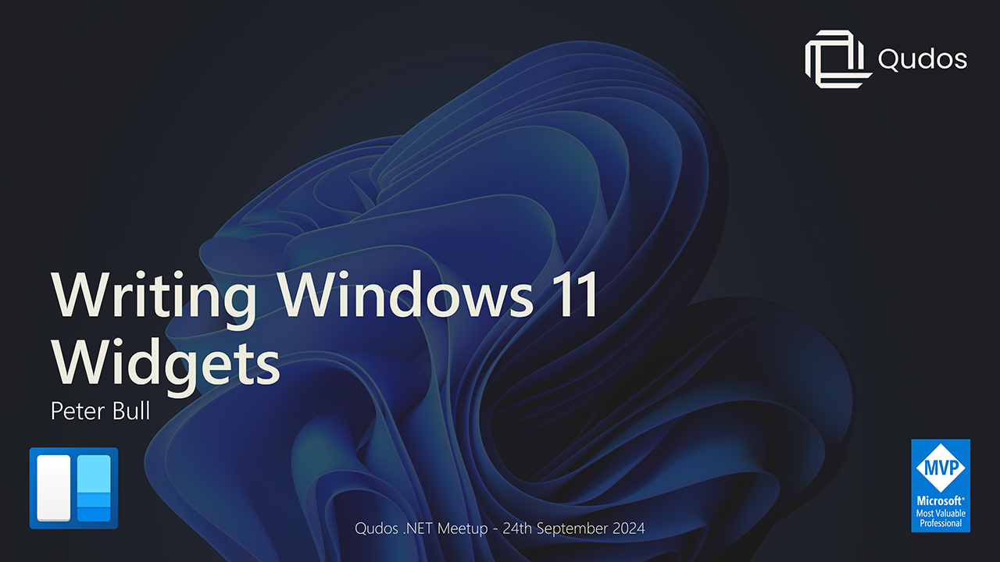

# Writing Windows 11 Widgets

## Presentation

Here you can find Slides, Code for the Demo and Links for my presentation **Writing Windows 11 Widgets**

## Links

* [dot.net](https://dot.net)
* [chatgpt.com](https://chatgpt.com)
* [windows.com](https://windows.com)
* [adaptivecards.io](https://adaptivecards.io)
* [aka.ms/winappsdk](https://www.aka.ms/winappsdk)
* [aka.ms/widgetdevdocs](https://www.aka.ms/widgetdevdocs)
* [comentsys.com/packages/toolkits](https://www.comentsys.com/packages/toolkits)
* [github.com/rogueplanetoid/writingwindows11widgets](https://www.github.com/rogueplanetoid/writingwindows11widgets)